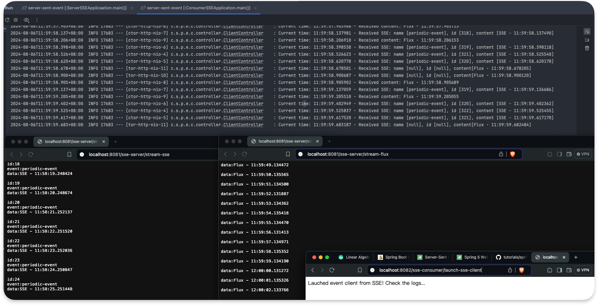

# Server sent event

Server-sent event 是基於 HTTP spec，提供一個建立由 server 端至 client 端， long-running 且單向頻道的連線。

Client 借助 `Accept` header 所列的 media type `text/event-stream` 來啟動這個 SSE connection，初始化之後就不用主動向 server 發送請求，可以自動接收更新（參考[官方文件](https://html.spec.whatwg.org/multipage/server-sent-events.html)）

### SSE with Spring 6 Webflux 

#### Test Result
1. 可以看到右邊是 flux stream，左邊是 server sent stream 的資料格式（包含 event ID 以及 data)
   

2. Console 實際像這樣，上半部視窗是 server side endpoint，下半部是 client side logs

   

[參考資料來源](https://www.baeldung.com/spring-server-sent-events)

#### Server:

http://localhost:8081/sse-server/stream-flux

http://localhost:8081/sse-server/stream-sse

#### Client:

http://localhost:8082/sse-consumer/launch-sse-from-flux-endpoint-client

http://localhost:8082/sse-consumer/launch-sse-client

http://localhost:8082/sse-consumer/launch-flux-client

### JAX-RS 2.1 implementation of SSE

[未完成]

實作 JAX-RS Server API 用以發布事件，另外也會用 (1) HTTP client 例如 `curl` 工具，或者使用 `JAX-RS Client API` 消費 server sent event

## 1. 瞭解 SSE event

SSE event 是一個 text block，包含以下 fields：

1. `Event` 事件 type，server 可以發送多種不同類型的訊息，client 可能只會監聽特定 type 的事件，或者可以根據不同 event type 做不同處理
2. `Data` 從 server 端發送的訊息，一樣的 event 可以包含很多行 data lines 
3. `Id` 事件的識別 ID，用來在 connection retry 之後發送 `Last-Event-ID` header，可以用來避免 Server 重複發送已經送過的事件
4. `Retry` 毫秒，是當 client 當前的連線失效時，需要花多少毫秒重新建立新的連線
5. `:`  這是註解，通常 client 會忽略之 

另外，兩個有連續性的事件是由 double newline `\n\n` 區隔開來

同一筆 event 裡面的資料如果有多行，寫法如下：

```
event: stock 
id: 1
: price change
retry: 4000
data: {"dateTime":"2018-07-14T18:06:00.285","id":1,
data: "name":"GOOG","price":75.7119}

event: stock
id: 2
: price change
retry: 4000
data: {"dateTime":"2018-07-14T18:06:00.285","id":2,"name":"IBM","price":83.4611}
```

> 在 JAX RS，一筆 SSE 事件由 `SseEvent` 介面做抽象化，或者細分成兩個子介面 `OutboundSseEvent`、`InboundSseEvent`
>
> `OutboundSseEvent` 是由 Server API 用來設計 sent event
>
> `InboundSseEvent` 則是由 Client API，用來將 received event 做抽象化

## 2. 如何發佈 SSE Events

#### 2-1. 建專案

使用的 dependency: `<groupId>javax</groupId><artifactId>javaee-api</artifactId>`

#### 2-2. SSE Resource Method

所謂的 SSE Resource 方法是一種 JAX RS 方法加上以下特性：

- 產生 `text/event-stream` media type

- 注入了一個 `SseEventSink` 參數，是事件發送的來源地

- 可能也會有一個 `Sse` 參數，作為建立 event builder 的入口點

  ```java
  @GET
  @Path("prices")
  @Produces("text/event-stream")
  public void getStockPrices(@Context SseEventSink sseEventSink, @Context Sse sse) {
    // some codes ...
  }
  ```

- 配置好之後，應該由 client 建立第一個 HTTP request，HTTP header 要有以下內容

  ```
  Accept: text/event-stream
  ```

#### 2-3. SSE Instance

SSE instance 是 context bean，這個 bean 會被 JAX RS Runtime 用來注入

可以將 Sse 作為一個工廠來使用，來建立：

- `OutboundSseEventBuilder` ：可以建立事件
- `SseBroadcaster` : 可以廣播事件到很多個訂閱者

```java
@Context
public void setSse(Sse sse) {
  this.sse = sse;
  this.eventBuilder = sse.newEventBuilder();
  this.sseBroadcaster = sse.newBroadcaster();
}
```

事件建構者：`OutboundSseEvent.Builder` 負責建立 `OutboundSseEvent`

```java
OutboundSseEvent sseEvent = this.eventBuilder
  .name("stock")
  .id(String.valueOf(lastEventId))
  .mediaType(MediaType.APPLICATION_JSON_TYPE)
  .data(Stock.class, stock)
  .reconnectDelay(4000)
  .comment("price change")
  .build();
```

如上所示，builder 的方法可以設置 event 的所有 field，而且`mediaType()`用來將 Java object data field 序列化成適當的 text format

如果沒指定，data field 預設的 media type 是 `text/plain`。但如果要處理 custom object，則需要指定 media type 或者提供 custom *MessageBodyWriter*。最常用的幾種 media types，JAX RS Runtime 都有提供 MessageBodyWriters

另外 Sse instance 也有兩個 builder shortcuts，用來建立只有 data field 有值，或 type field, data field 有值的事件：

```java
OutboundSseEvent sseEvent = sse.newEvent("cool Event");
OutboundSseEvent sseEvent = sse.newEvent("typed event", "data Event");
```

#### 2-4. 發送 simple event

`SseEventSink` 這個介面把單一的 HTTP 連線抽象化，JAX-RS Runtime 透過 SSE resource method 的注入，來實現此 interface。

`SseEventSink.send()` 調用這個方法就能發送一筆事件。下例是在發送多筆 stock updates 之後關閉 event stream：

```java
@GET
@Path("prices")
@Produces("text/event-stream")
public void getStockPrices(@Context SseEventSink sseEventSink /*..*/) {
    int lastEventId = //..;
    while (running) {
        Stock stock = stockService.getNextTransaction(lastEventId);
        if (stock != null) {
            OutboundSseEvent sseEvent = this.eventBuilder
                .name("stock")
                .id(String.valueOf(lastEventId))
                .mediaType(MediaType.APPLICATION_JSON_TYPE)
                .data(Stock.class, stock)
                .reconnectDelay(4000)
                .comment("price change")
                .build();
            sseEventSink.send(sseEvent);
            lastEventId++;
        } 
    }
    sseEventSink.close();
}
```

所有事件都發送完之後，server 關閉連線有兩種方式：(1) 顯式的調用 `close()` 方法，或者 (2) 因為 `SseEventSink` 繼承了`AutoClosable` 介面，使用 `try-with-resource` 子句，第二個方式更好

```java
try (SseEventSink sink = sseEventSink) {
    OutboundSseEvent sseEvent = // ..
    sink.send(sseEvent);
}
```

#### 2-5. 廣播 event

事件廣播是指事件同時送到多個 client 端，透過 `SseBroadcaster API` 實現，步驟有三：

##### 2-5-1. 建立 SseBroadcaster 物件

使用先前注入過的 Sse 建立 SseBroadcaster 物件

```java
SseBroadcaster sseBroadcaster = sse.newBroadcaster();
```

##### 2-5-2. Client 須要訂閱以接收 SseEvent

這步驟通常在 SSE resource method 完成，也就是 SseEventSink context instance 注入的地方

```java
@GET
@Path("subscribe")
@Produces(MediaType.SERVER_SENT_EVENTS)
public void listen(@Context SseEventSink sseEventSink) {
    this.sseBroadcaster.register(sseEventSink);
}
```

##### 2-5-3. 藉由調用 `broadcast()` 方法來觸發 event publishing 事件發布

```java
@GET
@Path("publish")
public void broadcast() {
    OutboundSseEvent sseEvent = //...;
    this.sseBroadcaster.broadcast(sseEvent);
}
```

這樣就會把相同的一則 event 送到每一個已經註冊的 `SseEventSink`

## 3. 消費 SSE Events

可以使用任何 HTTP client 消費 server 傳來的 SSE event，以下介紹 `JAX RS client API`

#### 3-1. JAX RS Client API for SSE

首先需要加入 JAX RS Client implementation 依賴

##### Gradle:

```groovy
ext {
  cxfVersion = '4.0.5'
}

dependencies {
  implementation 'org.apache.cxf:cxf-rt-rs-sse:${cxfVersion}'
  implementation 'org.apache.cxf:cxf-rt-rs-client:${cxfVersion}'
}
```

##### Maven:

```xml
<dependency>
    <groupId>org.apache.cxf</groupId>
    <artifactId>cxf-rt-rs-client</artifactId>
    <version>${cxf-version}</version>
</dependency>
<dependency>
    <groupId>org.apache.cxf</groupId>
    <artifactId>cxf-rt-rs-sse</artifactId>
    <version>${cxf-version}</version>
</dependency>
```

`SseEventSource` 是這個 API 的核心，由 `WebTarget` 所建構

先從監聽 `InboundSseEvent` 介面所抽象化的 incoming events:

```java
Client client = ClientBuilder.newClient();
WebTarget target = client.target(url);
try (SseEventSource source = SseEventSource.target(target).build()) {
  source.register((inboundSseEvent) -> System.out.println(inboundSseEvent));
  source.open();
}
```

一旦建立連線，每當接收到 `InboundSseEvent`，就會調用註冊事件的 consumer。可以使用 `readData()` 方法來讀取原本的 String data

```java
String data = inboundSseEvent.readData();
```

或者也可以使用 overloaded version 來取得反序列化的 Java Object

```java
Stock stock = inboundSseEvent.readData(Stock.class, MediaType.Application_Json);
```

## 比較 SSE streaming 與 WebSockets 的差異

WebSocket 提供 server-client 之間 full-duplex (雙向) 有來有往的溝通，但 SSE 使用的是 uni-directional 單向的溝通。

另外 WebSocket 並不是 HTTP protocol，而且跟 SSE 相反在 WebSocket 沒有提供錯誤處理的標準。


